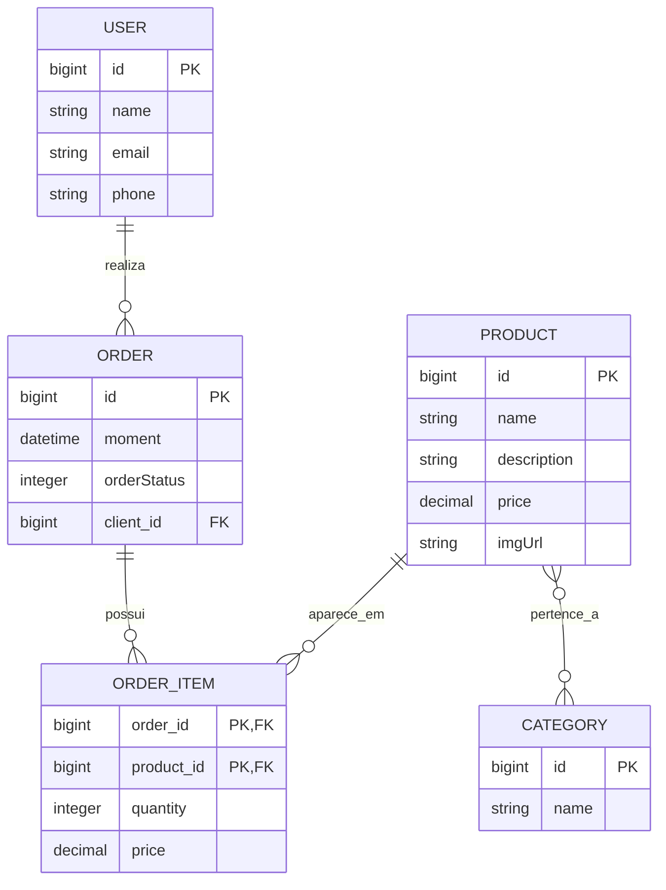

# Projeto Spring

> API REST de um pequeno e-commerce, desenvolvida para praticar Spring Boot, JPA e persistência relacional.

[](https://www.oracle.com/java/)
[](https://spring.io/projects/spring-boot)
[](https://maven.apache.org/)
[](#MIT)

## Sobre o projeto

O **Projeto Spring** é uma API de e-commerce com operações para consultar produtos, categorias, usuários e pedidos. O domínio foi modelado com entidades JPA e relacionamentos entre clientes, pedidos, produtos, categorias e itens de pedido.

O projeto também possui uma massa de dados inicial carregada automaticamente no perfil `test`, o que permite executar a aplicação e testar os endpoints imediatamente.

## Funcionalidades

- Consulta de usuários por lista ou identificador.
- Cadastro, atualização e remoção de usuários.
- Consulta de categorias e produtos.
- Consulta de pedidos e seus detalhes.
- Relacionamento entre produtos e categorias.
- Relacionamento entre usuários e pedidos.
- Itens de pedido com quantidade, preço e subtotal.
- Status de pedido: pagamento pendente, pago, enviado e outros estados do domínio.
- Tratamento padronizado de erros da API.
- Banco H2 em memória para desenvolvimento e testes.
- Suporte ao PostgreSQL em ambiente de execução.

## Tecnologias

- Java 26
- Spring Boot 4.1.1
- Spring Web MVC
- Spring Data JPA
- Hibernate
- H2 Database
- PostgreSQL
- Maven Wrapper

## Arquitetura

O código está organizado por responsabilidade:

```text
src/main/java/com/aprendizadojava/curso
├── config          # Configuração e carga de dados de teste
├── entities        # Entidades JPA do domínio
├── repositories    # Interfaces de acesso a dados
├── resources       # Controllers e endpoints REST
└── services        # Regras de negócio e serviços
```

### Modelo de domínio



## Como executar

### Pré-requisitos

- JDK 26 instalado e configurado no `PATH`.
- Git, caso o projeto ainda não esteja clonado.

### Clonar o repositório

```bash
git clone https://github.com/nlopesr/projeto-spring.git
cd projeto-spring
```

### Iniciar a aplicação

Linux/macOS:

```bash
./mvnw spring-boot:run
```

Windows:

```powershell
./mvnw.cmd spring-boot:run
```

A API ficará disponível em:

```text
http://localhost:8080
```

O perfil `test` é ativado por padrão e insere dados de exemplo na inicialização.

## Executar os testes

Linux/macOS:

```bash
./mvnw test
```

Windows:

```powershell
./mvnw.cmd test
```

## Endpoints

Todos os endpoints abaixo usam JSON.

| Método | Endpoint | Descrição |
| --- | --- | --- |
| `GET` | `/users` | Lista todos os usuários |
| `GET` | `/users/{id}` | Busca um usuário por ID |
| `POST` | `/users` | Cria um usuário |
| `PUT` | `/users/{id}` | Atualiza um usuário |
| `DELETE` | `/users/{id}` | Remove um usuário |
| `GET` | `/categories` | Lista todas as categorias |
| `GET` | `/categories/{id}` | Busca uma categoria por ID |
| `GET` | `/products` | Lista todos os produtos |
| `GET` | `/products/{id}` | Busca um produto por ID |
| `GET` | `/orders` | Lista todos os pedidos |
| `GET` | `/orders/{id}` | Busca um pedido por ID |

### Exemplos rápidos

Listar produtos:

```bash
curl http://localhost:8080/products
```

Buscar um pedido:

```bash
curl http://localhost:8080/orders/1
```

Criar um usuário:

```bash
curl -X POST http://localhost:8080/users \
  -H "Content-Type: application/json" \
  -d '{
    "name": "Joao Silva",
    "email": "joao@example.com",
    "phone": "11999999999",
    "password": "123456"
  }'
```

Atualizar um usuário:

```bash
curl -X PUT http://localhost:8080/users/1 \
  -H "Content-Type: application/json" \
  -d '{
    "name": "Joao da Silva",
    "email": "joao@example.com",
    "phone": "11999999999",
    "password": "123456"
  }'
```

## Banco H2

Com a aplicação em execução, o console do H2 pode ser acessado em:

```text
http://localhost:8080/h2-console
```

Use estas configurações:

| Campo | Valor |
| --- | --- |
| JDBC URL | `jdbc:h2:mem:testdb` |
| User Name | `sa` |
| Password | deixe vazio |

O banco é criado em memória e os dados são perdidos quando a aplicação é encerrada.

## Status dos pedidos

Os pedidos usam o enum `OrderStatus` para representar seu ciclo de vida. A resposta da API inclui o status correspondente ao pedido, além da data, cliente, itens e valor total.

## Próximos passos

Algumas evoluções naturais para o projeto:

- Adicionar documentação OpenAPI/Swagger.
- Criar autenticação e autorização com Spring Security.
- Implementar paginação e filtros nos endpoints de consulta.
- Configurar variáveis de ambiente para o PostgreSQL.
- Adicionar testes unitários e testes de integração para os recursos.
- Criar um front-end para consumir a API.

## Licença

Este projeto está licenciado sob a [Licença MIT](LICENSE).

A Licença MIT permite uso livre, modificação e distribuição do código, desde que a atribuição original seja mantida.
